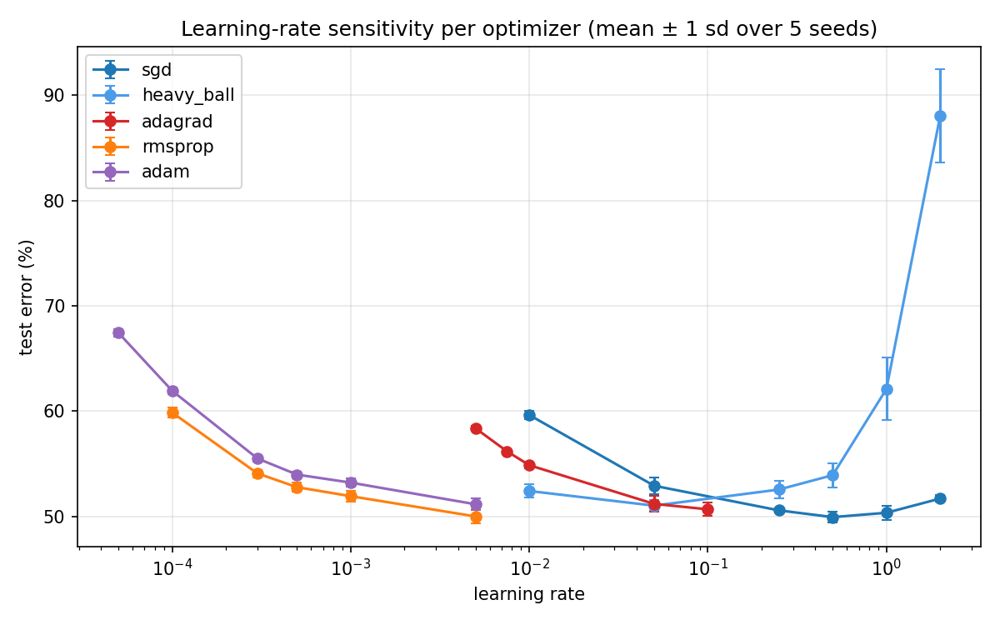
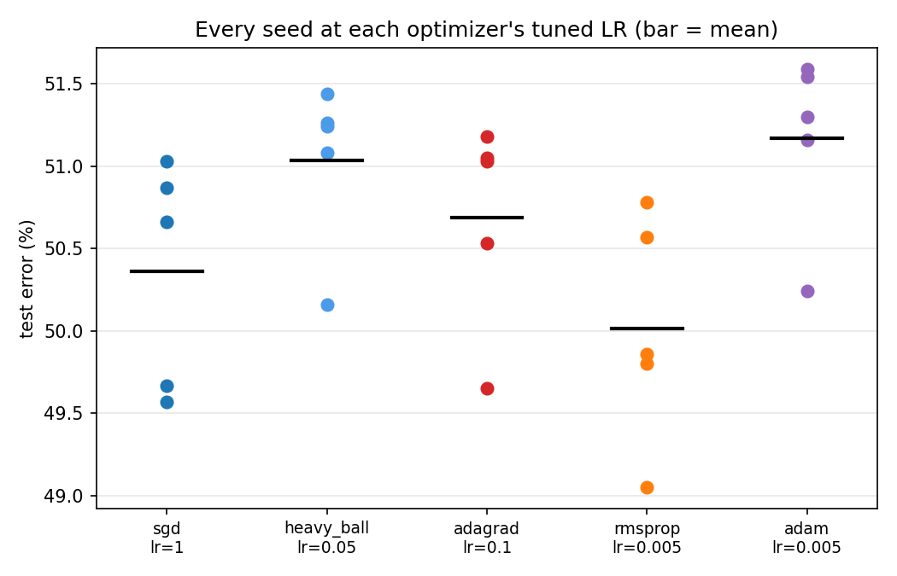
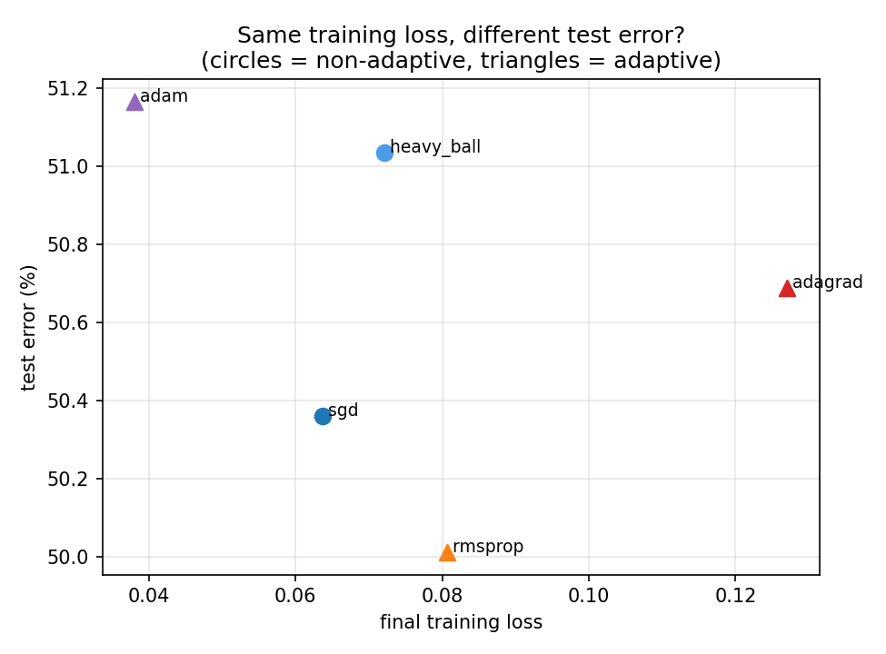

# Does the adaptive-vs-SGD generalization gap survive seed noise at small scale?

**An independent reproduction of the CIFAR-10 learning-rate sensitivity experiment in
Wilson et al. (2017), *The Marginal Value of Adaptive Gradient Methods in Machine Learning*.**

140 training runs · 28 configurations (the paper's exact learning-rate grids) × 5 seeds · 63 CPU-minutes · 0 divergences

---

## Result in one paragraph

The paper's headline — that non-adaptive methods find solutions that generalize better than
adaptive ones — **did not reproduce at this scale, and not because the sign flipped by a hair: it
flipped, and the flip is inside the noise.** Under the paper's own learning-rate selection rule,
our best non-adaptive method (SGD, 50.36 ± 0.69%) was *worse* than our best adaptive one
(RMSProp, 50.01 ± 0.69%) by 0.35 percentage points, against a pooled seed standard deviation of
0.69pp. Across all 25 seed-to-seed pairings, the non-adaptive run won only **36%** of the time.
At the same time, three of the paper's other claims reproduced cleanly, including the one that
matters most for practice: **learning rate dominates optimizer choice by roughly 8.5×**. The
honest summary is that at 2,000 training images and a 58,010-parameter network, *which* optimizer you
use is a coin flip and *what learning rate you give it* is everything.

| claim | what the paper says | what we found | verdict |
|---|---|---|---|
| **C1** | Best non-adaptive beats best adaptive (7.65 ± 0.14% vs 9.60 ± 0.19%, gap 1.95pp) | SGD 50.36 ± 0.69% vs RMSProp 50.01 ± 0.69%, gap **−0.35pp** (−0.51 pooled sd) | **DIVERGED** |
| **C2** | Adaptive methods reach the same training loss or lower | Adam 0.038 vs SGD 0.064 final training loss | **REPRODUCED** |
| **C3** | Tuned LRs span orders of magnitude across optimizers (~1,667×) | 200× (SGD 1.0 vs Adam/RMSProp 0.005); **0 of 5 optimizers selected the paper's exact LR** | **REPRODUCED** (ratio), with a large caveat below |
| **C4** | Library default learning rates are rarely optimal | 0 of 3 adaptive defaults were selected | **REPRODUCED** |
| **C5** | (variance) 5 seeds, ± 0.14 / 0.19pp | our seed sd is **0.51–0.69pp, 3–4× larger**; seed-level win rate 36% | reported — see below |
| **C6** | Learning rate is the decisive hyperparameter | LR spread within an optimizer 9.86pp (median) vs 1.15pp between optimizers at tuned LR | **REPRODUCED** |

Full numbers: [`results/summary.json`](results/summary.json) · per-configuration table:
[`results/table_by_config.csv`](results/table_by_config.csv) · verdict sheet:
[`results/VERDICTS.md`](results/VERDICTS.md) · every decision in order: [`RUNS_LOG.md`](RUNS_LOG.md).



---

## What was tested

Wilson, Roelofs, Stern, Srebro and Recht (2017), *The Marginal Value of Adaptive Gradient Methods
in Machine Learning* (NeurIPS 2017, [arXiv:1705.08292](https://arxiv.org/abs/1705.08292)), report
on CIFAR-10 with a VGG+BN+Dropout network:

> "The best overall test error found by a non-adaptive algorithm, SGD, was **7.65 ± 0.14%**, whereas
> the best adaptive method, RMSProp, achieved a test error of **9.60 ± 0.19%**."

and, more generally, that adaptive gradient methods "find solutions that generalize worse than
those found by non-adaptive methods" *despite reaching the same training loss or lower*.
Appendix D publishes the learning-rate grid searched for each optimizer and which value was
selected: **SGD 0.5, heavy ball 0.5, AdaGrad 0.01, RMSProp 0.0003, Adam 0.0003** — a factor of
~1,700 between the non-adaptive and adaptive ends. Learning rates were selected by **lowest final
training loss**, since the CIFAR-10 setup had no development set, and every number is a mean over
**5 runs from random initialisations**.

That combination — a published grid, published selected values, a published selection rule, a
numeric headline and the authors' own seed variance — is why this paper was chosen. It makes a
divergence falsifiable instead of a shrug.

## What this reproduction is, and is not

This is a **reproduction of the protocol at reduced scale**, not of the absolute numbers. The
paper's experiment is 28 configurations × 5 seeds of VGG16 on full CIFAR-10 — GPU-days. This was
run on **2 CPU cores**.

Held fixed from the paper:

* the exact learning-rate grid per optimizer, transcribed from Appendix D
* the five optimizers: SGD, heavy ball (β = 0.9), AdaGrad, RMSProp, Adam
* 5 random seeds per configuration
* learning-rate selection by **lowest final training loss** — never by test error
* a fixed-decay schedule (constant factor every *k* epochs)

Changed, and declared in `claims.yaml` before any run:

| id | deviation | why |
|---|---|---|
| D1 | 3-conv VGG-style net (16/32/64 ch, BN, 128-unit head) instead of VGG16 | 2 CPU cores |
| D2 | 2,000-image training subset (fixed across all runs); full 10,000-image test set | compute, and to reach the near-zero-training-loss regime the claim presumes |
| D3 | 30 epochs, fixed-decay ×0.5 every 6 epochs | compute |
| D4 | CIFAR-10 from a GitHub JPEG mirror | `cs.toronto.edu` blocked by the sandbox's egress policy |
| D5 | weight decay 0; augmentation = horizontal flips only | the paper does not report either; nonzero L2 would confound the adaptive arm (the AdamW issue) |
| D6 | batch 64; RMSProp ρ = 0.99; momentum 0.9; Adam β = (0.9, 0.999), ε = 1e-8 | the paper does not report these; these are the Torch-era defaults |
| D7 | inputs average-pooled from 32×32 to 16×16 | 5× cheaper per step; the only way to fit 140 runs in budget |
| D8 | dropout disabled | with dropout the scaled-down net never drove training error below ~45%, so the paper's premise (both families reaching comparable, near-zero training loss) was never met and C1/C2 would have been untestable. See `RUNS_LOG.md` §9. |

**Absolute test errors here are ~50%, not ~8%.** Nothing in this repo should be read as a
measurement of how well CIFAR-10 can be classified. What is being tested is whether the paper's
*relative* claims survive when the protocol is applied honestly at a scale where seed noise is
visible.

---

## What matched

**C2 — adaptive methods do reach lower training loss.** Adam at its selected LR ends at training
loss 0.038 and **0.01%** training error; SGD ends at 0.064 and 0.34%. The optimization half of the
paper's story holds exactly as described: the adaptive methods fit the training set at least as
well as the non-adaptive ones. It is the second half — that this comes at a cost on test data —
that does not follow here.

**C3 — the tuned learning rates really are orders of magnitude apart.** SGD's selected LR is 1.0;
Adam's and RMSProp's is 0.005, a factor of 200. The mechanism is the one the paper describes:
an adaptive update has magnitude ≈ η regardless of gradient scale, so η means something different
in each family. Anyone quoting "learning rate 0.001" without naming the optimizer is saying
nothing.

**C4 — defaults were not optimal for any adaptive method.** AdaGrad selected 0.1 (default 0.01),
RMSProp 0.005 (default 0.001), Adam 0.005 (default 0.001). Note this diverges from the paper in an
interesting direction: Wilson et al. found AdaGrad's *default* was its best value, and we did not.

**C6 — learning rate dominates, and not narrowly.** Varying the learning rate within a single
optimizer moves test error by a median of **9.86pp** (36.99pp for heavy ball, which blows up at the
top of the grid). Switching optimizer at each one's tuned learning rate moves it by **1.15pp** —
about one and a half seed standard deviations. That is an **8.5× ratio** in favour of tuning over
choosing.

## What diverged

**C1 — the headline generalization gap is absent, and it is absent in an informative way.**



All five optimizers land inside a 1.15pp band (50.01% to 51.17%) while individual seeds of a
*single* configuration span up to 1.73pp. The ordering is therefore not stable: in the 5 × 5
pairing of SGD seeds against RMSProp seeds, SGD wins 9 times out of 25.

We checked the most generous alternative reading, to rule out our selection rule as the
explanation. If the learning rate is chosen by **test** error instead — which the paper explicitly
does not do, and which leaks the test set — SGD's best is 49.95% and RMSProp's is 50.01%: a gap of
**0.07pp**, or 0.10 pooled standard deviations. The claim's direction is restored, its magnitude
is not. Under no selection rule available to us does this dataset and model produce a gap
resembling 1.95pp.

**C3's caveat — the paper's published grids do not bracket the optimum at this scale.** Look again
at the sensitivity figure: AdaGrad, RMSProp and Adam are all still *improving* at the largest
learning rate in the paper's grid, and all three selected that boundary value. Their true optima
lie somewhere above the published grid for this model. SGD (selected 1.0, with 0.5 and 2.0 both
worse) and heavy ball (selected 0.05) have interior optima and are trustworthy; the three adaptive
numbers are lower bounds on their tuned learning rates, not estimates of them. This is a concrete
transferability result: **a learning-rate grid published for one architecture cannot be assumed to
contain the optimum for another**, and a reproduction that silently reuses one may be tuning
against a ceiling. We reused the grid deliberately, because changing it would have meant
reproducing our own protocol rather than the paper's.

**Zero exact learning-rate matches.** None of our five selected values equals the paper's. SGD
1.0 vs 0.5; heavy ball 0.05 vs 0.5; AdaGrad 0.1 vs 0.01; RMSProp and Adam 0.005 vs 0.0003. The
heavy-ball result has a clean mechanical explanation — with β = 0.9 the effective step is ≈ 10×
the nominal one, so heavy ball at 0.05 is roughly SGD at 0.5, and it is the *paper's* pairing of
identical learning rates for SGD and heavy ball that is the surprising one. The adaptive
mismatches are the grid-ceiling artefact above.

## The variance, stated plainly

This is the part the artifact exists for.

* **Our seed-to-seed standard deviation at the tuned settings is 0.51–0.69pp.** The paper's is
  0.14 and 0.19pp. Ours is **3–4× larger**, which is expected: 2,000 training images and a small
  network produce a noisier estimate than 50,000 images and VGG16. Across all 28 configurations our
  median seed sd is 0.46pp, and the worst (heavy ball at LR 2.0, where training partially collapses)
  is **4.42pp**.
* **Our 1.15pp between-optimizer spread is ~1.7 pooled seed standard deviations.** That is not a
  measurement of optimizer quality. It is noise with an ordering printed on it.
* **The seed-level win rate is 36%.** Reporting "RMSProp beat SGD" from our means would be
  describing an outcome that reverses in 9 of 25 individual comparisons.

**Does this make the original's headline claim less certain than it reads?** Partly, and it is
worth being precise about which part. Wilson et al.'s own gap of 1.95pp against their own sd of
~0.15pp is about **10 pooled standard deviations** — internally, their claim is not a noise
artefact, and nothing here contradicts it *at their scale*. What our result does undercut is the
claim's portability. The paper is read, in practice, as "SGD generalizes better than Adam" full
stop; five seeds at one reduced scale were enough to produce the opposite ordering and to make the
difference statistically meaningless. A claim that survives its own error bars in one setting and
inverts in another is a claim about a setting, not about optimizers. The five-seed protocol that
made the original credible is also the minimum needed to notice this — at one seed each, we would
have reported a 1.98pp gap in *either* direction depending on which seed we drew (best SGD seed
49.57% vs worst RMSProp seed 50.78%, or worst SGD 51.03% vs best RMSProp 49.05%), and both
write-ups would have looked equally confident.



## Threats to validity

Ranked by how much they could plausibly explain the C1 divergence.

1. **Scale (D1, D2, D7).** 2,000 images, 16×16 inputs and a 3-conv net is a long way from 50,000
   images, 32×32 and VGG16. The implicit-regularization mechanism Wilson et al. propose may simply
   require a capacity and data regime we did not reach. This is the most likely explanation and we
   cannot rule it out from inside this budget.
2. **Grid ceiling (C3 caveat).** The adaptive arms were evaluated at a boundary optimum. Their
   *true* tuned performance could be better than what we measured, which would push C1 further from
   the paper, not closer.
3. **Dropout removed (D8).** The paper's network is VGG+BN+**Dropout**. Removing dropout was
   necessary to reach the near-zero-training-loss regime the claim presumes (see `RUNS_LOG.md` §9),
   but dropout is itself a regularizer, and its interaction with adaptive preconditioning is exactly
   the kind of thing that could carry the effect.
4. **Epoch budget (D3).** 30 epochs with four decays. The paper's curves run past epoch 100. Late
   training is where the generalization gap is usually reported to open.
5. **Under-specification in the original (D5, D6).** Batch size, decay factor δ, decay frequency
   *k*, weight decay, ε and augmentation are not reported for CIFAR-10 in the paper. We chose
   Torch-era defaults and set weight decay to 0 (nonzero L2 would confound the adaptive arm — the
   AdamW issue). Any of these could account for part of a divergence, and that is precisely why
   they are enumerated rather than buried.
6. **Data source (D4).** JPEG re-encodings rather than the canonical binary release. Expected to be
   negligible next to items 1–5, and listed only so it is not a hidden variable.

Two things this reproduction does **not** claim: that Wilson et al. are wrong, and that adaptive
methods generalize as well as SGD in general. It claims that at this scale, with the paper's own
grids, seeds and selection rule, the gap is not detectable and the ordering is not stable.

## Reproducing this

```bash
pip install -r requirements.txt
python src/prepare_data.py --out data/cifar10.npz      # canonical source, mirror fallback
python src/sweep.py --workers 2 --seeds 5              # 140 runs, ~35 min on 2 CPU cores
python src/aggregate_results.py                        # tables, verdicts, figures
```

Deterministic: seed *s* fixes initialisation, batch order and augmentation. The 2,000-image
training subset is fixed by `subset_seed=12345` across every run, so the seed spread measures
optimization noise alone, not data sampling. `results/runs.jsonl` is append-only and the sweep is
resumable.

```
claims.yaml                 pre-registered claims, verdict rules, declared deviations (frozen at P0)
RUNS_LOG.md                 every decision in order, including two harness bugs and one dead end
src/prepare_data.py         CIFAR-10 fetch and cache
src/train_harness.py        one run: model, optimizers, schedule, metrics
src/sweep.py                28 configs x 5 seeds, resumable, append-only JSONL
src/aggregate_results.py    verdicts computed mechanically from claims.yaml + figures
results/                    runs.jsonl, curves.jsonl, table_by_config.csv, summary.json, VERDICTS.md
figures/                    the four figures in this README
```

## Citation

Original work:

> A. C. Wilson, R. Roelofs, M. Stern, N. Srebro, B. Recht.
> *The Marginal Value of Adaptive Gradient Methods in Machine Learning.*
> NeurIPS 2017. [arXiv:1705.08292](https://arxiv.org/abs/1705.08292)

This reproduction: see [`CITATION.cff`](CITATION.cff).

## License

MIT. The CIFAR-10 dataset is redistributed by neither this repository nor its author; see
`src/prepare_data.py` for sources.
